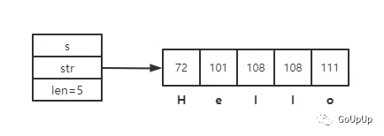
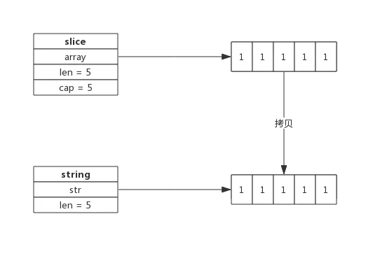

 string标准概念 

Go标准库 builtin 给出了所有内置类型的定义。源代码位于 src/builtin/builtin.go，其中关于string的描述如下:

```go

```

## 底层结构

在 src/reflect/value.go 文件中，对于 string 类型有两个结构体，如下：

```go
// StringHeader is the runtime representation of a string.
// It cannot be used safely or portably and its representation may
// change in a later release.
// Moreover, the Data field is not sufficient to guarantee the data
// it references will not be garbage collected, so programs must keep
// a separate, correctly typed pointer to the underlying data.
type StringHeader struct {
  Data uintptr
  Len  int
}

// stringHeader is a safe version of StringHeader used within this package.
type stringHeader struct {
  Data unsafe.Pointer
  Len  int
}
```

字符串底层结构定义在源码 runtime 包下的 string.go 文件中：

```go
// src/runtime/string.go
type stringStruct struct {
  str unsafe.Pointer
  len int
}
```

- str：一个指针，指向存储实际字符串的内存地址。
- len：字符串的长度。与切片类似，在代码中我们可以使用 len() 函数获取这个值。注意，**len存储实际的字节数，而非字符数。所以对于非单字节编码的字符，结果可能让人疑惑**。后面会详细介绍多字节字符。

看上面代码的注释可以知道，reflect/value.go 中的 StringHeader 结构是代表运行时的 string 类型。而 runtime/string.go 中的 stringStruct 结构是运行时 string 类型部分操作使用的一个结构，经常将 string 类型转成 stringStruct 类型然后在给两个字段赋值

对于字符串Hello，实际底层结构如下：



str 中存储的是字符对应的编码，H对应编码72，e对应101等等。

我们可以使用下面的代码输出字符串的底层结构和存储的每个字节：

```go
package main

import (
  "fmt"
  "unsafe"
)

type stringStruct struct {
  str unsafe.Pointer
  len int
}

func main() {
  s := "Hello World!"
  fmt.Println(*(*stringStruct)(unsafe.Pointer(&s)))

  for _, b := range s {
    fmt.Println(b)
  }
}
```

运行输出：

```go
{0x4bbc5d 12}
```

由于 runtime.stringStruct 结构是非导出的，我们不能直接使用。所以我在代码中手动定义了一个 stringStruct 结构体，字段与 runtime.stringStruct 完全相同。

## string 操作

### 声明

如下代码所示，可以声明一个 string 变量并赋予初值：

```go
 var str string
 str = "Hello World"
```

字符串构建过程是先根据字符串构建 stringStruct，再转换成 string。转换的源码如下：

```go
func gostringnocopy(str *byte) string { // 根据字符串地址构建 string
 ss := stringStruct{str: unsafe.Pointer(str), len: findnull(str)} // 先构造stringStruct
 s := *(*string)(unsafe.Pointer(&ss))                             // 再将stringStruct转换成string
 return s
}
```

string 在 runtime 包中就是 stringStruct，对外呈现叫做 string。

### []byte 转 string

byte 切片可以很方便的转换成 string，如下所示：

```go
func GetStringBySlice(s []byte) string {
    return string(s)
}
```

需要注意的是这种转换需要一次内存拷贝。

转换过程如下：

1. 根据切片的长度申请内存空间，假设内存地址为 p，切片长度为 len(b)；
2. 构建 string（string.str = p；string.len = len；）

1. 拷贝数据(切片中数据拷贝到新申请的内存空间)

转换示意图：



### string 转 []byte

string也可以方便的

转成byte切片，如下所示：

```go
func GetSliceByString(str string) []byte {
    return []byte(str)
}
```

string 转换成 byte 切片，也需要一次内存拷贝，其过程如下：

- 申请切片内存空间
- 将string拷贝到切片

转换示意图：


在 `src/runtime/string.go` 文件中，有两个函数 `stringtoslicebyte` 和 `slicebytetostring`，这两个就是其实现的函数。

```go
// Buf is a fixed-size buffer for the result,
// it is not nil if the result does not escape.
func slicebytetostring(buf *tmpBuf, b []byte) (str string) {
  l := len(b)
  if l == 0 {
    // Turns out to be a relatively common case.
    // Consider that you want to parse out data between parens in "foo()bar",
    // you find the indices and convert the subslice to string.
    return ""
  }
  if raceenabled {
    racereadrangepc(unsafe.Pointer(&b[0]),
      uintptr(l),
      getcallerpc(),
      funcPC(slicebytetostring))
  }
  if msanenabled {
    msanread(unsafe.Pointer(&b[0]), uintptr(l))
  }
  if l == 1 {
    stringStructOf(&str).str = unsafe.Pointer(&staticbytes[b[0]])
    stringStructOf(&str).len = 1
    return
  }

  var p unsafe.Pointer
  if buf != nil && len(b) <= len(buf) {
    p = unsafe.Pointer(buf)
  } else {
    p = mallocgc(uintptr(len(b)), nil, false)
  }
  stringStructOf(&str).str = p
  stringStructOf(&str).len = len(b)
  memmove(p, (*(*slice)(unsafe.Pointer(&b))).array, uintptr(len(b)))
  return
}

type stringStruct struct {
  str unsafe.Pointer
  len int
}

func stringStructOf(sp *string) *stringStruct {
  return (*stringStruct)(unsafe.Pointer(sp))
}
```

上面的代码是 `[]byte` 转 `string` 的实现（核心代码就是26行至35行）：

- 首先定义指针 p，如果 buf 不是 nil 并且切片 b 的长度小于等于 buf 的长度，那么 p 就指向 buf 数组。否则分配一块内存，大小为切片 b 的长度，并且 p 指向这块内存。
- 将返回值 str 字符串指针转成 stringStruct 的指针，其 str 字段就是上一步的指针 p，len 字段就是切片 b 的长度。
- 再将切片 b 内存数据移动到指针 p 下。此时 返回值 str 字符串变量就是切片 b 的数据。

### 字符串拼接

字符串可以很方便的拼接，像下面这样：

```go
str := "Str1" + "Str2" + "Str3"
```

即便有非常多的字符串需要拼接，性能上也有比较好的保证，因为新字符串的内存空间是一次分配完成的，所以性能消耗主要在拷贝数据上。

一个拼接语句的字符串编译时都会被存放到一个切片中，拼接过程需要遍历两次切片，第一次遍历获取总的字符串长度，据此申请内存，第二次遍历会把字符串逐个拷贝过去。

字符串拼接伪代码如下：

```go
func concatstrings(a []string) string { // 字符串拼接
    length := 0        // 拼接后总的字符串长度

    for _, str := range a {
        length += length(str)
    }

    s, b := rawstring(length) // 生成指定大小的字符串，返回一个string和切片，二者共享内存空间

    for _, str := range a {
        copy(b, str)    // string无法修改，只能通过切片修改
        b = b[len(str):]
    }
    
    return s
}
```

因为 string 是无法直接修改的，所以这里使用 rawstring() 方法初始化一个指定大小的 string，同时返回一个切片，二者共享同一块内存空间，后面向切片中拷贝数据，也就间接修改了 string。

rawstring()源代码如下：

```go
func rawstring(size int) (s string, b []byte) { // 生成一个新的string，返回的string和切片共享相同的空间
 p := mallocgc(uintptr(size), nil, false)

 stringStructOf(&s).str = p
 stringStructOf(&s).len = size

 *(*slice)(unsafe.Pointer(&b)) = slice{p, size, size}

 return
}
```

## 为什么字符串不允许修改？

像 C++ 语言中的 string，其本身拥有内存空间，修改 string 是支持的。但 Go 的实现中，string 不包含内存空间，只有一个内存的指针，这样做的好处是 string 变得非常轻量，可以很方便的进行传递而不用担心内存拷贝。

因为 string 通常指向字符串字面量，而字符串字面量存储位置是只读段，而不是堆或栈上，所以才有了 string 不可修改的约定。

```go
str := "hello"
p := unsafe.Pointer(&str)
var sl1 = new([]byte)
sl1 = (*[]byte)(p)
(*sl1)[0] = 1
fmt.Println(string(*sl1))
```

上面的代码很简单，主要目的就是对于变量 `str` 的空间更改一下数据，运行这段代码是会报错的，原因就是 `string` 都是分配在只读内存上，强行修改就会出错。

## for 循环与 rune

```go

s := "hello"
for k, v := range s {
  fmt.Println(k)          // 0,1,2,3,4
  fmt.Println(string(v))  // h,e,l,l,o
}

s = "hello世界哈"
for k, v := range s {
  fmt.Println(k)         // 0,1,2,3,4,5,8,11
  fmt.Println(string(v)) // h,e,l,l,o,世,界,哈
}
```

上面代码大家执行结果和大家预想的是否一致？当我们使用 `go tool compile -S` 命令时，我们就会发现，对于 `string`  类型的底层使用了 `runtime.decoderune` 这个函数，位置在：`go/src/runtime/utf8.go` 中。这里我们不再细讲这个函数的实现，我们首先要明白对于汉字和英文字母其大小是不一样的，Go 中使用的是 utf-8，一个因为字母是1字节，一个汉字是3字节（关于编码部分会在以后的文章中和大家讨论）。所以说对于字符串的 for 遍历，其实遍历的是 `码点（codepoint）` ，也就是对于汉字这种大小不是1字节的，我们使用 for 循环时是不用担心的。

这是大家可能就会想对于 `hello世界哈` 这个字符串 for 循环时下标没有`5,6,7,9,10`，那么我们修改了会怎样呢？看下面的代码

```go
s := "hello世界哈"
fmt.Println(string(s[5])) // ä
```

对于上面代码，如果我们不知道 Go 中 `string` 的底层或者不明白 `utf-8` 或者码点等，那么就可能认为字符串 `hello世界哈` 下标为5的应该是汉字 `世`，但实际情况并不是，我们已经通过 for 循环的形式知道了 `string` 底层下标的规则了，想必这个问题大家以后敲代码应该不会再犯这个错误了。

此时应该有同学问了，那如果想根据下标修改或者查看某个位置怎么办？那应该就是下面的情况了：

```go
s := "hello世界哈"
sb := []byte(s)
fmt.Println(string(sb)) // hello世界哈
sb[1] = 97
fmt.Println(string(sb)) // hallo世界哈
sb[5] = 97
fmt.Println(string(sb)) // halloa��界哈
```

那么怎么解决上面的问题呢？那就继续看下面的代码：

```go
s := "hello世界哈"
sr := []rune(s)
fmt.Println(string(sr))    // hello世界哈
fmt.Println(len(sr))       // 8
fmt.Println(string(sr[7])) // 哈

s1 := "你好"
s1r := []rune(s1)
sr[7] = s1r[1]
fmt.Println(string(sr))   // hello世界好
```

上面代码就将 `hello世界哈` 中的 `哈` 字改成了 `好` 字。

## []byte 转换成 string 一定会拷贝内存吗？

byte 切片转换成 string 的场景很多，为了性能上的考虑，有时候只是临时需要字符串的场景下，byte 切片转换成string 时并不会拷贝内存，而是直接返回一个 string，这个 string 的指针 (string.str) 指向切片的内存。

比如，编译器会识别如下临时场景：

- 使用 m[string(b)] 来查找 map（map 是 string 为 key，临时把切片 b 转成 string）；
- 字符串拼接，如 "<" + "string(b)" + ">"；
- 字符串比较：string(b) == "foo"

因为是临时把 byte 切片转换成string，也就避免了因byte切片同容改成而导致string引用失败的情况，所以此时可以不必拷贝内存新建一个string。

## string和[]byte如何取舍

string 和 []byte都可以表示字符串，但因数据结构不同，其衍生出来的方法也不同，要跟据实际应用场景来选择。

string 擅长的场景：

- 需要字符串比较的场景；
- 不需要nil字符串的场景；

[]byte擅长的场景：

- 修改字符串的场景，尤其是修改粒度为1个字节；
- 函数返回值，需要用nil表示含义的场景；

- 需要切片操作的场景；

虽然看起来string适用的场景不如[]byte多，但因为string直观，在实际应用中还是大量存在，在偏底层的实现中[]byte使用更多。

### 语法糖

​	大家都知道内置的 `copy`  和  `append` 函数可以操作切片，同样也是可以操作 `string` 类型的：

```go
slice1 := make([]byte, 10)
string1 := "hello"
copy(slice1, string1)
fmt.Println(string(slice1)) // hello

slice2 := make([]byte, 0)
string2 := "world"
slice2 = append(slice2, string2...)
fmt.Println(string(slice2)) // world
```

这种写法可以算是 Go 提供给我们的一种语法糖，也就是我们可以省略将 `string` 类型转换成 `[]byte` 类型这一步。