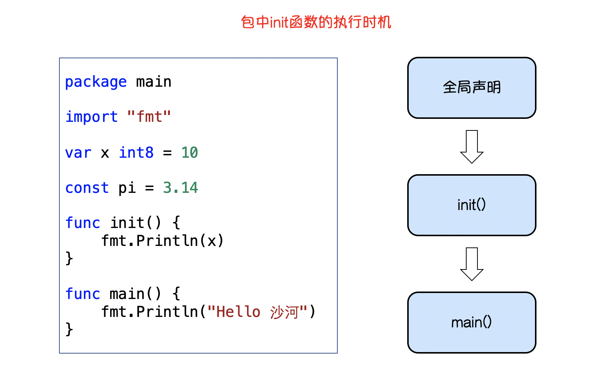
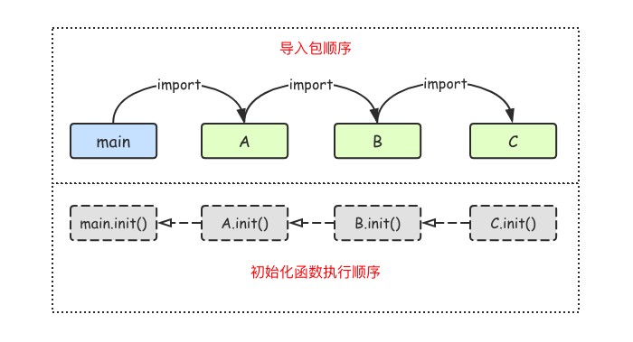

### 包的可见性

如果想在一个包中引用另外一个包里的标识符（如变量、常量、类型、函数等）时，该标识符必须是对外可见的（public）。在Go语言中只需要将标识符的首字母大写就可以让标识符对外可见了。

举个例子， 我们定义一个包名为`pkg2`的包，代码如下：

```go
package pkg2

import "fmt"

// 包变量可见性

var a = 100 // 首字母小写，外部包不可见，只能在当前包内使用

// Mode 首字母大写外部包可见，可在其他包中使用
const Mode = 1

type person struct { // 首字母小写，外部包不可见，只能在当前包内使用
	name string
}

// Add 首字母大写，外部包可见，可在其他包中使用
func Add(x, y int) int {
	return x + y
}

func age() { // 首字母小写，外部包不可见，只能在当前包内使用
	var Age = 18 // 函数局部变量，外部包不可见，只能在当前函数内使用
	fmt.Println(Age)
}
```

结构体中的字段名和接口中的方法名如果首字母都是大写，外部包可以访问这些字段和方法。例如：

```go
type Student struct {
	Name  string //可在包外访问的方法
	class string //仅限包内访问的字段
}

type Payer interface {
	init() //仅限包内访问的方法
	Pay()  //可在包外访问的方法
}
```


### 自定义包名

在导入包名的时候，我们还可以为导入的包设置别名。通常用于导入的包名太长或者导入的包名冲突的情况。

```
import 别名 "包的路径"
```

实例：

```go
import (
    "fmt"
    m "github.com/Q1mi/studygo/pkg_test"
 )

func main() {
	fmt.Println(m.Add(100, 200))
	fmt.Println(m.Mode)
}
```


### init()初始化函数

在Go语言程序执行时<font color='red'>导入包语句会自动触发包内部`init`函数的调用</font>。需要注意的是：`init`函数没有参数也没有返回值。`init`函数在程序运行时自动被调用执行，不能在代码中主动调用它。

包初始化执行的顺序如下图所示：



```go
var age = test()

func test() int {
	fmt.Println("test()...")
	return 90
}

func init() {
	fmt.Println("init()...")
}

func main() {
	fmt.Println("main.go()...")
}
```

运行结果：

```go
test()...
init()...
main()...
```

不同文件`init()`函数执行顺序




### 依赖管理

#### GOPATH

默认在~/go(unix, linux), %USERPROFILE%\go(windows)

最早的时候，Go所依赖的所有的第三方库都放在GOPATH这个目录下面。这就导致了同一个库只能保存一个版本的代码。如果不同的项目依赖同一个第三方的库的不同版本，应该怎么解决？

#### godep

Go语言从v1.5开始引入`vendor`模式，如果项目目录下有vendor目录，那么go工具链会优先使用`vendor`内的包进行编译、测试等。

`godep`是一个通过vender模式实现的Go语言的第三方依赖管理工具，类似的还有由社区维护准官方包管理工具`dep`。

##### 安装

执行以下命令安装`godep`工具。

```go
go get github.com/tools/godep
```

##### 基本命令

安装好godep之后，在终端输入`godep`查看支持的所有命令。

```bash
godep save     将依赖项输出并复制到Godeps.json文件中
godep go       使用保存的依赖项运行go工具
godep get      下载并安装具有指定依赖项的包
godep path     打印依赖的GOPATH路径
godep restore  在GOPATH中拉取依赖的版本
godep update   更新选定的包或go版本
godep diff     显示当前和以前保存的依赖项集之间的差异
godep version  查看版本信息
```

使用`godep help [command]`可以看看具体命令的帮助信息。

##### 使用godep

在项目目录下执行`godep save`命令，会在当前项目中创建`Godeps`和`vender`两个文件夹。

其中`Godeps`文件夹下有一个`Godeps.json`的文件，里面记录了项目所依赖的包信息。 `vender`文件夹下是项目依赖的包的源代码文件。

##### vender机制

Go1.5版本之后开始支持，能够控制Go语言程序编译时依赖包搜索路径的优先级。

例如查找项目的某个依赖包，首先会在项目根目录下的`vender`文件夹中查找，如果没有找到就会去`$GOAPTH/src`目录下查找。

##### godep开发流程

1. 保证程序能够正常编译
2. 执行`godep save`保存当前项目的所有第三方依赖的版本信息和代码
3. 提交Godeps目录和vender目录到代码库。
4. 如果要更新依赖的版本，可以直接修改`Godeps.json`文件中的对应项

#### go module

